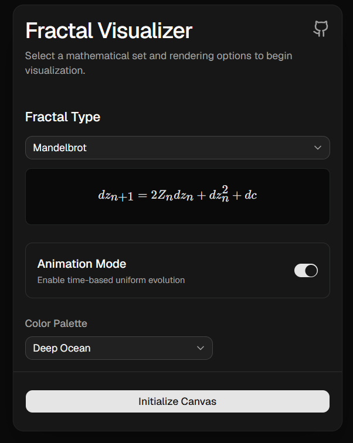
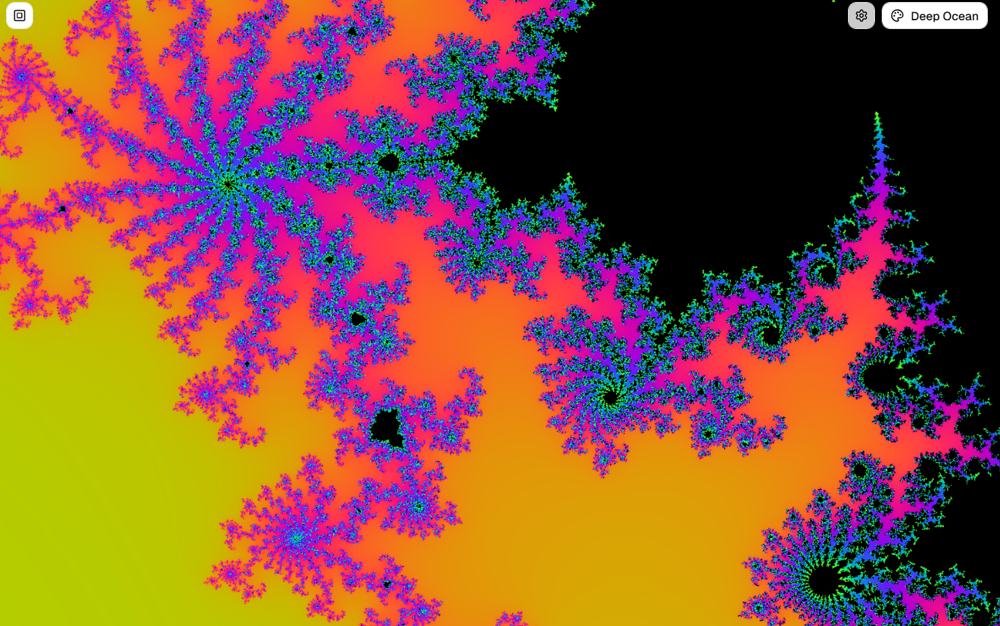

# Fractal Visualizer

An interactive, real-time fractal explorer that runs in the browser. Pan and zoom deep into the Mandelbrot set, the Burning Ship and Julia sets, rendered on the GPU with WebGL and powered by a C++ math core compiled to WebAssembly.




## Features

- **Three fractals**: Mandelbrot set, Burning Ship, and Julia set
- **Smooth, real-time rendering**: a fragment shader computes every pixel on the GPU, with smooth (continuous) coloring to avoid banding
- **Deep zoom** using perturbation theory (see [How it works](#how-it-works))
- **Four color palettes** (Deep Ocean, Cyberpunk Neon, Monochrome, Alpine Forest), switchable live
- **Animated colors**: an optional time-based palette shift you can toggle on and off
- **Desktop and mobile navigation**: mouse drag and scroll wheel, or touch drag and pinch-to-zoom
- **Zoom-to-cursor**: the point under your cursor (or fingers) stays fixed while zooming
- **Re-center button** to jump back to the default view of the current fractal
- **LaTeX equation display** of the perturbation formula for the selected fractal (via KaTeX)

## Controls

| Action | Desktop | Mobile |
| --- | --- | --- |
| Pan | Click and drag | One-finger drag |
| Zoom | Scroll wheel | Pinch |
| Reset view | Top-left "Re Center View" button | Same |
| Change palette | Palette dropdown (top right) | Same |
| Pause / start color animation | Settings menu (top right) | Same |
| Copy page link | Settings menu → Share Link | Same |
| Return to the start screen | Settings menu → Back to Menu | Same |

Zoom-out is limited to a minimum zoom of `0.1` so you can't lose the fractal entirely.

## Getting started

### Prerequisites

- [Node.js](https://nodejs.org/) (a recent LTS version) and npm

### Install and run

```bash
git clone https://github.com/Ludovico02/fractal-visualizer.git
cd fractal-visualizer
npm install
npm run dev
```

Then open the local URL printed by Vite (usually http://localhost:5173).

### Other scripts

| Command | Description |
| --- | --- |
| `npm run dev` | Start the Vite dev server with hot reload |
| `npm run build` | Type-check with `tsc` and create a production build in `dist/` |
| `npm run preview` | Serve the production build locally |
| `npm run lint` | Run ESLint |

The compiled WebAssembly engine (`engine/engine.js` and `engine/engine.wasm`) is committed to the repo, so you **don't** need Emscripten just to run or build the app.

## How it works

Rendering a Mandelbrot-style fractal at high zoom normally requires more precision than a GPU's 32-bit floats can provide, which causes blocky, pixelated images once you zoom in far enough. This project uses **perturbation theory** to push that limit back:

1. **Reference orbit (CPU, 64-bit).** Whenever the view changes, the C++/WebAssembly engine computes the orbit of a single reference point (the center of the view) in double precision and returns up to 200 iterations of it.
2. **Delta iteration (GPU, 32-bit).** The orbit is uploaded to the fragment shader as a uniform array. Each pixel then only iterates its small *offset* (`dz`) from the reference orbit, using the recurrence for the selected fractal, for example for the Mandelbrot set:

   ```
   dz(n+1) = 2·Z(n)·dz(n) + dz(n)² + dc
   ```

   Small offsets are well within what 32-bit floats can represent accurately, even when the absolute coordinates are not.
3. **Fallback.** If the reference orbit escapes before the shader's iteration limit, the shader continues the remaining iterations with standard 32-bit math.
4. **Coloring.** Escape times are smoothed with a logarithmic correction and mapped through a cosine-based palette (`a + b·cos(2π(c·t + d))`), optionally shifted over time for animation.

The per-fractal GLSL is injected into the shader template at runtime by replacing the `// __FRACTAL_CORE_PLACEHOLDER__` marker in `fractal.frag`, so adding a fractal doesn't require duplicating the whole shader.

## Project structure

```
fractal-visualizer/
├── engine/                     # C++ math core + Emscripten output
│   ├── fractal_math.cpp        # calculateReferenceOrbit() exported to JS
│   ├── formulas.h              # Mandelbrot / Burning Ship / Julia iteration steps
│   ├── engine.js               # Generated Emscripten glue code
│   └── engine.wasm             # Generated WebAssembly binary
├── src/
│   ├── App.tsx                 # Switches between the menu and the visualizer
│   ├── components/
│   │   ├── MainMenu.tsx        # Start screen: fractal, palette, animation options
│   │   ├── FractalCanvas.tsx   # <canvas> wired to WebGL + navigation hooks
│   │   ├── HUD.tsx             # In-viewer controls (settings, palette, re-center)
│   │   └── ui/                 # shadcn/ui components
│   ├── hooks/
│   │   ├── useWasm.ts          # Loads and initializes the WebAssembly engine
│   │   ├── useWebGL.ts         # Shader setup, uniforms, render loop
│   │   └── useFractalNavigation.ts  # Mouse, wheel and touch pan/zoom
│   ├── constants/
│   │   ├── fractals.ts         # Fractal presets (equation, GLSL core, default view)
│   │   └── palettes.ts         # Color palette definitions
│   ├── shaders/
│   │   ├── fractal.frag        # Fragment shader template
│   │   └── fullscreen.vert     # Full-screen quad vertex shader
│   └── types/                  # Shared TypeScript types
└── vite.config.ts
```

## Tech stack

- [React](https://react.dev/) + [TypeScript](https://www.typescriptlang.org/)
- [Vite](https://vite.dev/)
- [WebGL](https://developer.mozilla.org/en-US/docs/Web/API/WebGL_API) (GLSL fragment shader)
- C++ compiled to WebAssembly with [Emscripten](https://emscripten.org/)
- [Tailwind CSS](https://tailwindcss.com/) and [shadcn/ui](https://ui.shadcn.com/) (Base UI)
- [KaTeX](https://katex.org/) for equation rendering
- [Lucide](https://lucide.dev/) icons

## Modifying the engine

Only needed if you change `engine/fractal_math.cpp` or `engine/formulas.h`. Install the [Emscripten SDK](https://emscripten.org/docs/getting_started/downloads.html), then from the `engine/` directory run:

```bash
emcc fractal_math.cpp -o engine.js \
  -s EXPORTED_RUNTIME_METHODS="['ccall','cwrap','HEAPF64']" \
  -s EXPORTED_FUNCTIONS="['_calculateReferenceOrbit']" \
  -s MODULARIZE=1 \
  -s EXPORT_NAME="createFractalEngine" \
  -s EXPORT_ES6=1
```

This regenerates `engine.js` and `engine.wasm`.

## Adding a new fractal

1. Add the iteration step to `engine/formulas.h` and register it by name in `calculateReferenceOrbit` in `engine/fractal_math.cpp`, then rebuild the engine (see above).
2. Add a preset to `src/constants/fractals.ts` with:
   - `id` and `name`
   - `equation`: the LaTeX string shown in the menu
   - `glslCore`: the GLSL snippet that advances `dz` and sets `Z_abs` each iteration
   - `defaultCenter` and `defaultZoom`
3. Add a special case in `src/hooks/useWebGL.ts` if the fractal needs different reference-orbit inputs (as Julia does).

The menu and renderer pick up any new entry in `FRACTAL_PRESETS` automatically.

## Known limitations and roadmap

- The shader iterates a maximum of 200 times per pixel, so extremely deep zooms lose detail.
- The Julia set uses a fixed seed (`-0.8 + 0.156i`); sliders to morph it are planned.
- The 64-bit reference orbit is calculated exclusively at the viewport center. If the center coordinate escapes significantly earlier than the surrounding pixels (a "poor fit"), the engine currently lacks dynamic orbit rebasing. In these edge cases at extreme zooms, the shader degrades to standard 32-bit precision, resulting in visible block artifacts.
- Some browsers may lag at high zoom.
- "Share Link" copies the current page URL; it doesn't yet encode the view position or settings.

## License

[MIT](./LICENSEù)